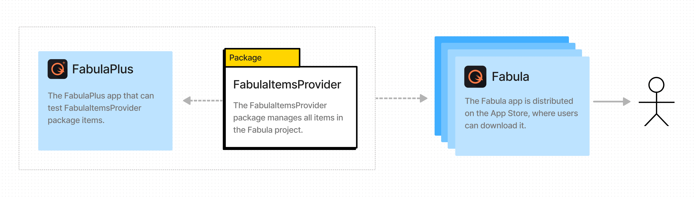
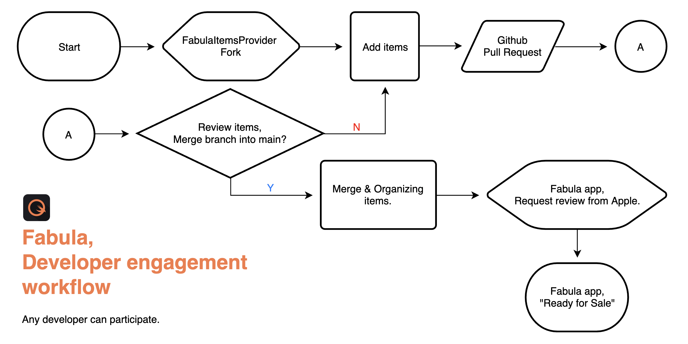
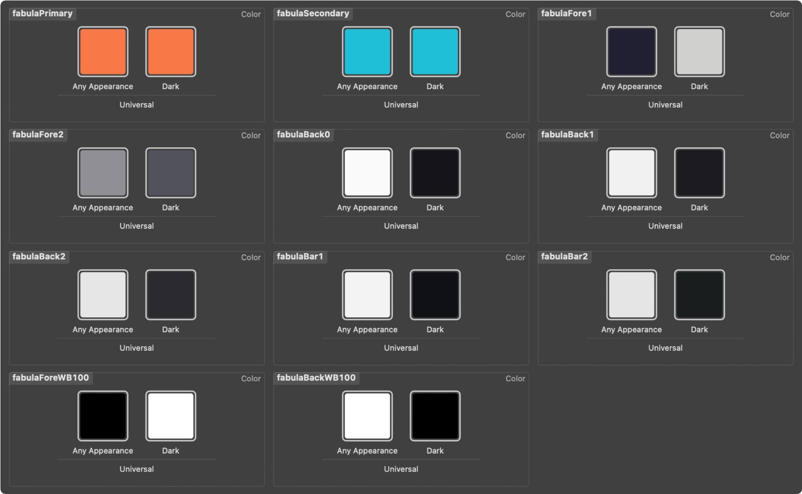

# **FabulaItemsProvider**
This is the source package for the Fabula project.  
You can share and communicate with developers around the world through the [Fabula app](https://apps.apple.com/app/id1591155142).  

[](https://apps.apple.com/app/id1591155142)
[](https://developer.apple.com/iOS)
[](https://developer.apple.com/macOS)
[](https://apps.apple.com/app/id1591155142)
[](https://www.instagram.com/dev.fabula)
[](https://developer.apple.com/documentation/swift_packages/package/)
[](https://opensource.org/licenses/MIT)  
[](https://apps.apple.com/app/id1591155142)  

## Structure


## Workflow


## How developers participate.
1. Add items to the FabulaItemsProvider
      ```swift
      import SwiftUI

      public struct P1000_Example: View {

          public init() {}
          public var body: some View {
              VStack {
                  ExampleSubView1()
                  ExampleSubView2()
              }
          }
      }

      fileprivate
      struct ExampleSubView1: View {
          var body: some View {
              Text("Hello, World!")
          }
      }

      fileprivate
      struct ExampleSubView2: View {
          var body: some View {
              Text("Hello, Fabula!")
          }
      }

      struct P1000_Example_Previews: PreviewProvider {
          static var previews: some View {
              P1000_Example()
          }
      }
      ```

2. Add ItemData to ItemsProvider
      ```swift
      import SwiftUI

      public class ItemsProvider {
          ...
          public var items: [ItemData] {
              [
                  ...
                  ItemData(id: 1000, category: .study,
                           section: "Section name",
                           createDate: "2022-01-07",
                           title: "Title",
                           caption: "Caption",
                           creator: "Your name",
                           tags: "Search tags",
                           view: FAnyView(P1000_Example())),
              ]
          }
      }
      ```
3. Build test with Fabula+ app.
4. Pull Request
5. Merge & Waiting for review

***
## Color style


## Contact
instagram : [@dev.fabula](https://www.instagram.com/dev.fabula)  
email : [dev.fabula@gmail.com](mailto:dev.fabula@gmail.com)

## License
FabulaItemsProvider is available under the MIT license. See the [LICENSE](LICENSE) file for more info.
